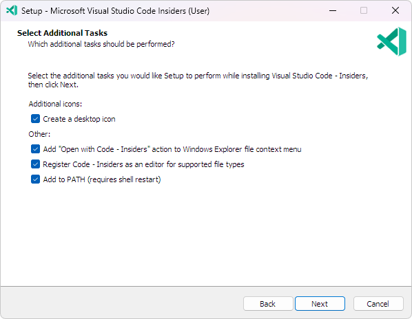
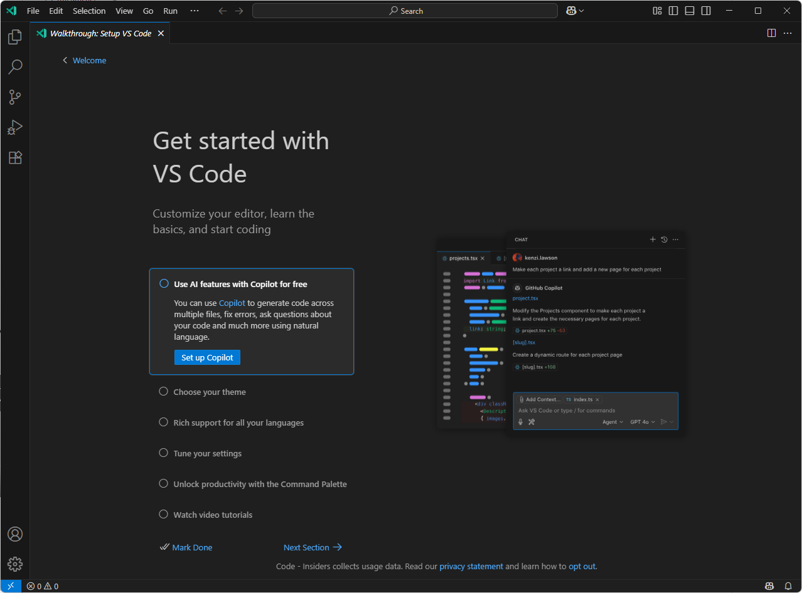
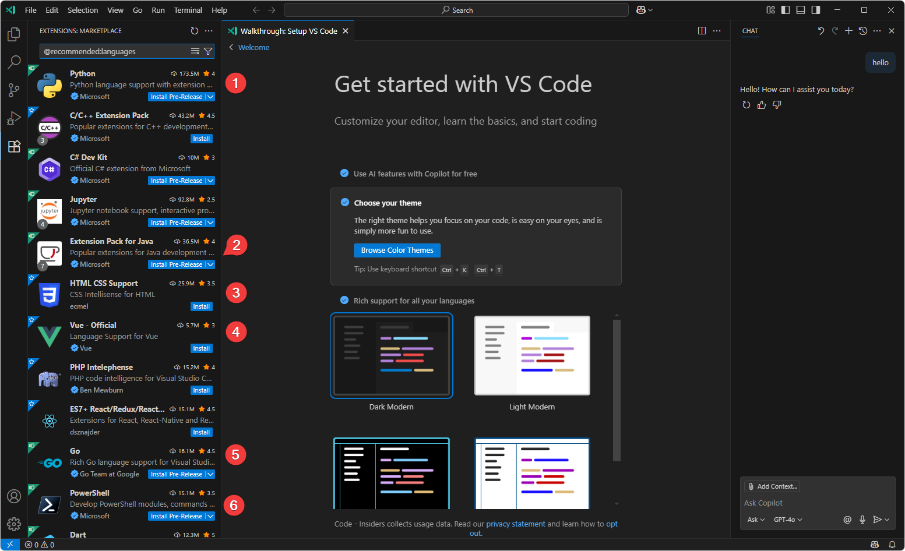

# VS Code Installation and Core Plugins

*   **Download and Installation**:
    *   Visit the [official VS Code website](https://code.visualstudio.com/) to download the Insider version or the [Insiders version](https://code.visualstudio.com/insiders/).
    *   Installation steps for various platforms (Windows, macOS, Linux).
*   **Essential Core Plugins**:
    *   **GitHub Copilot**: AI programming assistant that greatly improves coding efficiency.
    *   **GitLens**: Enhanced Git capabilities.

After downloading the installation package, we recommend that you select the following options:

After the installation is complete, open vscode-insider, you can see the user boot interface, and follow this process step by step. It can be seen that installing github copilot is the first step, which also marks the close integration of modern IDE development tools with AI large models, and vibe coding is the general trend.

When choosing a programming language, you can refer to the technology stack that our project will use, including web terminal, back-end Java, Go development, as well as basic operation and maintenance, data development, etc.

